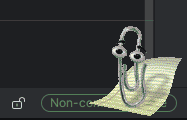

# Bongo Cat + V-Pets Wayland Overlay

[](https://opensource.org/licenses/MIT)
[](https://github.com/furudbat/wayland-vpets/releases)

A delightful Wayland overlay that displays an animated V-Pet reacting to your keyboard input! 
Perfect for streamers, content creators, or anyone who wants to add some fun to their desktop.

  
_Classic Bongocat_

  
_Digimon V-Pets_

  
_MS Agent Clippy_

## ✨ Features

- **🐈 More Pets** - More Sprite to choose from
  - Bongocat 😺
  - Digimon V-Pets 🦖 (v1.3.0)
  - Clippy 📎 (v2.1.0)
- **🎯 Real-time Animation** - Bongo cat reacts instantly to keyboard input
- **🔥 Hot-Reload Configuration** - Modify settings without restarting (v1.2.0)
- **🔄 Dynamic Device Detection** - Automatically detects Bluetooth/USB keyboards (v1.2.0)
- **⚡ Performance Optimized** - Adaptive monitoring and batch processing (v1.4.0)
  - triggers rendering, only when needed (v2.0.0)
- **🖥️ Screen Detection** - Automatic screen detection for all sizes and orientations (v1.2.2)
- **🎮 Smart Fullscreen Detection** - Automatically hides during fullscreen applications (v1.2.3)
- **🖥️ Multi-Monitor Support** - Choose which monitor to display on in multi-monitor setups (v1.2.4)
- **😴 Sleep Mode** - Scheduled or idle-based sleep mode with custom timing (v1.2.5)
- **🎨 Customizable Appearance** - Fine-tune position, size, alignment, and opacity
- **💾 Lightweight** - Minimal resource usage (~10MB RAM, depends on the loaded sprites)
  - Lazy loading - Load only used assets into RAM (v2.4.0)
- **🎛️ Multi-device Support** - Monitor multiple keyboards simultaneously
- **🏗️ Cross-platform** - Works on x86_64 and ARM64
- **😄 Happy Frame** - Reach KPM (Keystroke per minute) to trigger the happy frame (Digimon)

## 🚀 Installation

### Arch Linux (Recommended)

```bash
# Using yay
yay -S bongocat

# Using paru
paru -S bongocat

# Run immediately
bongocat --watch-config

# Custom config with hot-reload
bongocat --config ~/.config/bongocat.conf --watch-config
```

### Other Distributions

<details>
<summary>Fedora</summary>

```bash
# Install dependencies
sudo dnf install wayland-devel wayland-protocols-devel gcc make

# Build from source
git clone https://github.com/furudbat/wayland-vpets.git
cd wayland-vpets
make

# Run
./build/bongocat
```

</details>

<details>
<summary>NixOS</summary>

```bash
# Quick start with flakes
nix run github:furudbat/wayland-vpets -- --watch-config

# Install to user profile
nix profile install github:furudbat/wayland-vpets
```

📖 **For comprehensive NixOS setup, see [nix/NIXOS.md](nix/NIXOS.md)**

</details>

## 🎮 Quick Start

### 1. Setup Permissions

```bash
# Add your user to the input group
sudo usermod -a -G input $USER
# Log out and back in for changes to take effect
```

### 2. Find Your Input Devices

```bash
# If installed via AUR
bongocat-find-devices

# If built from source
./scripts/find_input_devices.sh
```

### 3. Run with Hot-Reload

```bash
# AUR installation
bongocat --watch-config

# From source
./build/bongocat --watch-config
```

## ⚙️ Configuration

Bongo Cat uses a simple configuration file format. With hot-reload enabled (`--watch-config`), changes apply instantly without restarting.

### Basic Configuration

Create or edit `bongocat.conf`:

```ini
# Position settings
cat_x_offset=0                   # Horizontal offset from center position
cat_y_offset=0                   # Vertical offset from default position
cat_align=center                 # Horizontal alignment in the bar (left/center/right)

# Size settings
cat_height=80                    # Height of bongo cat (10-200)

# Visual settings
mirror_x=0                       # Flip horizontally (mirror across Y axis)
mirror_y=0                       # Flip vertically (mirror across X axis)

# Overlay settings (requires restart)
overlay_height=60                # Height of the entire overlay bar (20-300)
overlay_opacity=150              # Background opacity (0-255)
overlay_position=top             # Position on screen (top/bottom)
layer=top                        # Layer type (top/overlay)

# Animation settings
idle_frame=0                     # Frame to show when idle (0-3)
fps=60                           # Frame rate (1-120)
keypress_duration=100            # Animation duration (ms)
test_animation_duration=200      # Test animation duration (ms)
test_animation_interval=0        # Test animation every N seconds (0=off)

# Input devices (add multiple lines for multiple keyboards)
keyboard_device=/dev/input/event4
# keyboard_device=/dev/input/event20  # External/Bluetooth keyboard

# Multi-monitor support
monitor=eDP-1                    # Specify which monitor to display on (optional)

# Sleep mode settings
enable_scheduled_sleep=0         # Enable scheduled sleep mode (0=off, 1=on)
sleep_begin=20:00                # Begin of sleeping phase (HH:MM)
sleep_end=06:00                  # End of sleeping phase (HH:MM)
idle_sleep_timeout=0             # Inactivity timeout before sleep (seconds, 0=off)

# Debug
enable_debug=0                   # Show debug messages
```

### Configuration Reference

| Setting                   | Type     | Range / Options                        | Default             | Description                                                                    |
| ------------------------- |----------|----------------------------------------|---------------------|--------------------------------------------------------------------------------|
| `cat_height`              | Integer  | 10–200                                 | 40                  | Height of bongo cat in pixels (width auto-calculated to maintain aspect ratio) |
| `cat_x_offset`            | Integer  | -9999 to 9999                          | 100                 | Horizontal offset from center (behavior depends on `cat_align`)                |
| `cat_y_offset`            | Integer  | -9999 to 9999                          | 10                  | Vertical offset from center (positive=down, negative=up)                       |
| `cat_align`               | String   | "center", "left", "right"              | "center"            | Horizontal alignment of cat inside overlay bar                                 |
| `overlay_height`          | Integer  | 20–300                                 | 50                  | Height of the entire overlay bar                                               |
| `overlay_position`        | String   | "top" or "bottom"                      | "top"               | Position of overlay on screen                                                  |
| `overlay_opacity`         | Integer  | 0–255                                  | 60                  | Background opacity (0=transparent, 255=opaque)                                 |
| `animation_name`          | String   | "bongocat", `<digimon name>`, "clippy" | "bongocat"          | Name of the V-Pet sprite (see list below)                                      |
| `invert_color`            | Boolean  | 0 or 1                                 | 0                   | Invert color (useful for white digimon sprites & dark mode)                    |
| `padding_x`               | Integer  | 0–9999                                 | 0                   | Horizontal padding per frame (ignored for bongocat)                            |
| `padding_y`               | Integer  | 0–9999                                 | 0                   | Vertical padding per frame (ignored for bongocat)                              |
| `idle_frame`              | Integer  | 0–2 (varies by sprite type)            | 0                   | Which frame to use when idle (sprite-specific options)                         |
| `idle_animation`          | Boolean  | 0 or 1                                 | 0                   | Enable idle animation                                                          |
| `animation_speed`         | Integer  | 0–5000                                 | 0                   | Frame duration in ms (0 = use `fps`)                                           |
| `keypress_duration`       | Integer  | 50–5000                                | 100                 | Duration to display keypress animation (ms)                                    |
| `mirror_x`                | Boolean  | 0 or 1                                 | 0                   | Flip cat horizontally (mirror across Y axis)                                   |
| `mirror_y`                | Boolean  | 0 or 1                                 | 0                   | Flip cat vertically (mirror across X axis)                                     |
| `test_animation_duration` | Integer  | 0–5000                                 | 0                   | Duration of test animation (ms) (deprecated, use `animation_speed`)            |
| `test_animation_interval` | Integer  | 0–60                                   | 0                   | Interval for test animation in seconds (0 = disabled, deprecated)              |
| `fps`                     | Integer  | 1–144                                  | 60                  | Animation frame rate                                                           |
| `input_fps`               | Integer  | 0–144                                  | 0                   | Input thread frame rate (0 = use `fps`)                                        |
| `enable_scheduled_sleep`  | Boolean  | 0 or 1                                 | 0                   | Enable scheduled sleep mode                                                    |
| `sleep_begin`             | String   | "00:00" – "23:59"                      | "00:00"             | Start time of scheduled sleep (24h format)                                     |
| `sleep_end`               | String   | "00:00" – "23:59"                      | "00:00"             | End time of scheduled sleep (24h format)                                       |
| `idle_sleep_timeout`      | Integer  | 0+                                     | 0                   | Time of inactivity before entering sleep (0 = disabled) (in seconds)           |
| `happy_kpm`               | Integer  | 0–10000                                | 0                   | Minimum keystrokes per minute to trigger happy animation (0 = disabled)        |
| `keyboard_device`         | String   | Valid `/dev/input/*` path(s)           | `/dev/input/event4` | Input device path (multiple entries allowed)                                   |
| `enable_debug`            | Boolean  | 0 or 1                                 | 0                   | Enable debug logging                                                           |
| `monitor`                 | String   | Monitor name                           | Auto-detect         | Which monitor to display on (e.g., "eDP-1", "HDMI-A-1")                        |

#### Available Sprites (`animation_name`)

##### Bongocat 😺

- `bongocat`

##### MS Agent 📎

- `clippy`

<details>
<summary>More Agents</summary>

_Build with `-DFEATURE_MS_AGENT_EMBEDDED_ASSETS` and `-DFEATURE_MORE_MS_AGENT_EMBEDDED_ASSETS`, see [CMake](CMakeLists.txt)_

- `links`

</details>

##### Digimon 🦖

###### Original [dm](https://humulos.com/digimon/dm/)

<details>
<summary>Default Minimal Sprites (from dm Version 1) when no other dms are compiled</summary>

- `botamon`
- `koromon`
- `agumon`
- `betamon`
- `greymon`
- `tyranomon`
- `devimon`
- `meramon`
- `airdramon`
- `seadramon`
- `numemon`
- `metal_greymon`
- `mamemon`
- `monzaemon`

</details>


<details>

<summary>Full List</summary>

_Build with `-DFEATURE_ENABLE_DM_EMBEDDED_ASSETS` and `-DFEATURE_DM_EMBEDDED_ASSETS`, see [CMake](CMakeLists.txt)_

- `aegisdramon`
- `agumon`
- `airdramon`
- `alphamon`
- `andromon`
- `angemon`
- `apollomon`
- `babydmon`
- `bakemon`
- `bancho_mamemon`
- `bao_hackmon`
- `barbamon`
- `beezlebumon`
- `belial_vamdemon`
- `belphemon_rage_mode`
- `betamon`
- `birdramon`
- `blitz_greymon`
- `botamon`
- `breakdramon`
- `centalmon`
- `cockatrimon`
- `coelamon`
- `coredramon_blue`
- `coredramon_green`
- `coronamon`
- `craniummon`
- `crescemon`
- `cres_garurumon`
- `cyclomon`
- `dark_tyranomon`
- `deathmon`
- `deltamon`
- `demon`
- `devidramon`
- `devimon`
- `dianamon`
- `digitamamon`
- `dodomon`
- `dorimon`
- `dorugamon`
- `doruguremon`
- `dorumon`
- `dracomon`
- `drimogemon`
- `duftmon`
- `dukemon`
- `duramon`
- `durandamon`
- `dynasmon`
- `elecmon`
- `etemon`
- `examon`
- `ex_tyranomon`
- `firamon`
- `flaremon`
- `flymon`
- `gabumon`
- `gankoomon`
- `garurumon`
- `gazimon`
- `giromon`
- `gizamon`
- `grace_novamon`
- `greymon`
- `groundramon`
- `hackmon`
- `hi_andromon`
- `imperiadramon_paladin`
- `jesmon`
- `jijimon`
- `kabuterimon`
- `king_etemon`
- `koromon`
- `kunemon`
- `kuwagamon`
- `lekismon`
- `leomon`
- `leviamon`
- `lilithmon`
- `lord_knightmon`
- `lucemon_falldown`
- `lunamon`
- `magnamon`
- `mamemon`
- `megadramon`
- `meicoomon`
- `meicrackmon`
- `meramon`
- `metal_greymon`
- `metal_greymon_virus`
- `metal_mamemon`
- `metal_tyranomon`
- `mojyamon`
- `monochromon`
- `monzaemon`
- `mugendramon`
- `murmukusmon`
- `nanimon`
- `nanomon`
- `numemon`
- `nyaromon`
- `ogremon`
- `omegamon_alter_s`
- `omegamon`
- `pagumon`
- `palmon`
- `patamon`
- `petitmon`
- `piccolomon`
- `pinochimon`
- `pitchmon`
- `piyomon`
- `plotmon`
- `poyomon`
- `pukamon`
- `punimon`
- `raremon`
- `rasielmon`
- `rust_tyranomon`
- `sakumon`
- `sakuttomon`
- `savior_hackmon`
- `scumon`
- `seadramon`
- `shellmon`
- `skull_greymon`
- `skull_mammon`
- `slayerdramon`
- `sleipmon`
- `taichis_agumon`
- `taichis_greymon`
- `taichis_metal_greymon`
- `taichis_war_greymon`
- `tanemon`
- `titamon`
- `tokomon`
- `tunomon`
- `tuskmon`
- `tyranomon`
- `ulforce_v_dramon`
- `unimon`
- `vademon`
- `vegimon`
- `whamon`
- `wingdramon`
- `yamatos_gabumon`
- `yamatos_garurumon`
- `yamatos_metal_garurumon`
- `yamatos_were_garurumon`
- `yukidarumon`
- `yukimi_botamon`
- `yuramon`
- `zubaeagermon`
- `zubamon`
- `zurumon`

</details>


###### 20th Anniversary [dm20](https://humulos.com/digimon/dm20/)

<details>
<summary>Full List</summary>

_Build with `-DFEATURE_ENABLE_DM_EMBEDDED_ASSETS` and `-DFEATURE_DM20_EMBEDDED_ASSETS`, see [CMake](CMakeLists.txt)_
_dm20 will replace dm, if both are enabled_

Should be the same as dm, but with some extras:


</details>


###### X [dmx](https://humulos.com/digimon/dmx/)

<details>
<summary>Full List</summary>

_Build with `-DFEATURE_ENABLE_DM_EMBEDDED_ASSETS` and `-DFEATURE_DMX_EMBEDDED_ASSETS`, see [CMake](CMakeLists.txt)_

- `agumon_black_x`
- `agumon_x`
- `allomon_x`
- `alphamon_ouryuken`
- `alphamon`
- `ancient_sphinxmon`
- `angewomon_x`
- `anomalocarimon_x`
- `bagramon`
- `barbamon_x`
- `beel_starmon_x`
- `beelzebumon_x`
- `belial_vamdemon`
- `belphemon_x`
- `black_wargreymon_x`
- `cannon_beemon`
- `cerberumon_x`
- `chaosdramon_x`
- `cherubimon_vice_x`
- `cherubimon_virtue_x`
- `chocomon`
- `cho_hakkaimon`
- `cocomon`
- `craniummon_x`
- `crys_paledramon`
- `cyberdramon_x`
- `damemon`
- `dark_knightmon_x`
- `darkness_bagramon`
- `dark_tyranomon_x`
- `demon_x`
- `diablomon_x`
- `dinorexmon`
- `dinotigermon`
- `dorugamon`
- `doruguremon`
- `dorumon`
- `dracomon_x`
- `duftmon_x`
- `dukemon_x`
- `duskmon`
- `dynasmon_x`
- `ebemon_x`
- `examon`
- `examon_x`
- `filmon`
- `gabumon_x`
- `gaioumon`
- `gankoomon_x`
- `garudamon_x`
- `giga_seadramon`
- `ginryumon`
- `goddramon_x`
- `gomamon_x`
- `grademon`
- `grand_darcumon`
- `grandis_kuwagamon`
- `growmon_x`
- `gummymon`
- `herissmon`
- `hexeblaumon`
- `hisyaryumon`
- `holydramon_x`
- `hououmon_x`
- `impmon_x`
- `jararchimon`
- `jazamon`
- `jazardmon`
- `jesmon_gx`
- `jesmon_x`
- `justimon_x`
- `kaiser_leomon`
- `keemon`
- `keramon_x`
- `kiimon`
- `kokuwamon_x`
- `kuwagamon_x`
- `lady_devimon_x`
- `leomon_x`
- `leviamon_x`
- `lilimon_x`
- `lilithmon_x`
- `lopmon_x`
- `lord_kightmon_x`
- `lucemon_x`
- `magidramon_x`
- `magnamon_x`
- `mamemon_x`
- `mame_tyramon`
- `mammon_x`
- `mantaraymon_x`
- `megalo_growmon_x`
- `mega_seadramon_x`
- `mephismon_x`
- `meramon_x`
- `metal_fantomon`
- `metal_garurumon_x`
- `metal_greymon_virus_x`
- `metal_greymon_x`
- `metallicdramon`
- `metal_piranimon`
- `metal_tyranomon_x`
- `minervamon_x`
- `monzaemon_x`
- `nefertimon_x`
- `noble_pumpmon`
- `numemon_x`
- `ogremon_x`
- `ogudomon_x`
- `okuwamon_x`
- `omegamon_x`
- `omega_shoutmon_x`
- `omekamon`
- `ophanimon_falldown_mode`
- `ophanimon_x`
- `otamamon_x`
- `ouryumon`
- `paledramon`
- `palmon_x`
- `pegasmon_x`
- `platinum_numemon`
- `plesiomon_x`
- `plotmon_x`
- `prince_mamemon_x`
- `pteranmon_x`
- `pumpmon`
- `puttimon`
- `rafflesimon`
- `raihimon`
- `rapidmon_x`
- `rasenmon_fury_mode`
- `rasenmon`
- `rekamon_x`
- `rhinomon_x`
- `rize_greymon_x`
- `rosemon_x`
- `ryudamon`
- `sakuyamon_x`
- `sangoupmon`
- `seadramon_x`
- `shakomon_x`
- `siesamon_x`
- `sistermon_blanc`
- `skull_baluchimon`
- `skull_mammon_x`
- `sleipmon_x`
- `stiffimon`
- `tailmon_x`
- `tierriermon_x`
- `tiger_vespamon`
- `tobcatmon`
- `togemon_x`
- `tokomon_x`
- `triceramon_x`
- `tylomon_x`
- `tyranomon_x`
- `ulforce_v_dramon_x`
- `ultimate_brachimon`
- `valdurmon`
- `vamdemon_x`
- `velgrman`
- `voltobautamon`
- `war_greymon_x`
- `were_garurumon_x`
- `wizarmon_x`
- `yaamon`
- `yatagaramon`
- `zerimon`

</details>

## 🔧 Usage

### Command Line Options

```bash
bongocat [OPTIONS]

Options:
  -h, --help             Show this help message
  -v, --version          Show version information
  -c, --config           Specify config file (default: bongocat.conf)
  -w, --watch-config     Watch config file for changes and reload automatically
  -o, --output-name     Specify output name (overwrite output_name from config)
  -t, --toggle           Toggle bongocat on/off (start if not running, stop if running)
```

### Examples

```bash
# Basic usage
bongocat

# With hot-reload (recommended)
bongocat --watch-config

# Custom config with hot-reload
bongocat --config ~/.config/bongocat.conf --watch-config

# Debug mode
bongocat --watch-config --config bongocat.conf

# Toggle mode
bongocat --toggle

# Custom config with hot-reload and custom output_name
bongocat --watch-config --output-name DP-2 --config ~/.config/bongocat.conf
```

## 🛠️ Building from Source

### Prerequisites

**Required:**

- Wayland compositor with layer shell support
- C23/C++26 compiler (GCC 15+ or Clang 19+)
- Make or CMake
- libwayland-client
- wayland-protocols
- wayland-scanner

### Build Process

```bash
# Clone repository
git clone https://github.com/fudurbat/wayland-vpets.git
cd wayland-vpets

# Build (production)
make

# Build (debug)
make debug

# Clean
make clean
```

The build process automatically:

1. Generates Wayland protocol files
2. Compiles with optimizations and security hardening
3. Embeds assets directly in the binary
4. Links with required libraries

## 🔍 Device Discovery

The `bongocat-find-devices` tool provides professional input device analysis with a clean, user-friendly interface:

```bash
$ bongocat-find-devices

╔══════════════════════════════════════════════════════════════════╗
║ Wayland Bongo Cat - Input Device Discovery v2.3.0                ║
╚══════════════════════════════════════════════════════════════════╝

[SCAN] Scanning for input devices...

[DEVICES] Found Input Devices:
┌─────────────────────────────────────────────────────────────────┐
│ Device: AT Translated Set 2 keyboard                            │
│ Path:   /dev/input/event4                                       │
│ Type:   Keyboard                                                │
│ Status: [OK] Accessible                                         │
└─────────────────────────────────────────────────────────────────┘

┌─────────────────────────────────────────────────────────────────┐
│ Device: Logitech MX Keys                                        │
│ Path:   /dev/input/event20                                      │
│ Type:   Keyboard (Bluetooth)                                    │
│ Status: [OK] Accessible                                         │
└─────────────────────────────────────────────────────────────────┘

[CONFIG] Configuration Suggestions:
Add these lines to your bongocat.conf:

keyboard_device=/dev/input/event4   # AT Translated Set 2 keyboard
keyboard_device=/dev/input/event20  # Logitech MX Keys
```

### Advanced Features

```bash
# Show all input devices (including mice, touchpads)
bongocat-find-devices --all

# Generate complete configuration file
bongocat-find-devices --generate-config > bongocat.conf

# Test device responsiveness (requires root)
sudo bongocat-find-devices --test

# Show detailed device information
bongocat-find-devices --verbose

# Get help and usage information
bongocat-find-devices --help
```

### Key Features

- **Smart Detection** - Automatically identifies keyboards vs other input devices
- **Device Classification** - Distinguishes between built-in, Bluetooth, and USB keyboards
- **Permission Checking** - Verifies device accessibility and provides fix suggestions
- **Config Generation** - Creates ready-to-use configuration snippets
- **Device Testing** - Integrated evtest functionality for troubleshooting
- **Professional UI** - Clean, colorized output with status indicators
- **Error Handling** - Comprehensive error messages and troubleshooting guidance

## 📊 Performance

### System Requirements

This program is lightweight and runs even on very modern desktop systems.  
Minimal builds require just a few MB of RAM, while asset-heavy builds may use more memory.

## 🖥️ System Requirements

|                | Minimum                                                  | Recommended                                                                  |
|----------------|----------------------------------------------------------|------------------------------------------------------------------------------|
| **CPU**        | Any modern **x86_64** or **ARM64** processor (SSE2/NEON) | Dual-core **x86_64** or **ARM64** processor                                  |
| **RAM**        | **5 MB free** (minimal build with minimal assets)        | **32 MB free** (full builds with all assets, preloaded, and config overhead) |
| **Storage**    | **1 MB free** (binary + config files)                    | **5 MB free** (multiple binaries/builds + config files)                      |
| **Compositor** | Wayland with **wlr-layer-shell** protocol support        | Modern Wayland compositor (Sway, Hyprland, Wayfire, KDE Plasma 6)            |


### Tested Compositors

- ✅ **Hyprland** - Full support
- ✅ **Sway** - Full support
- ✅ **Wayfire** - Compatible
- ✅ **KDE Wayland** - Compatible
- ❌ **GNOME Wayland** - Unsupported

## 🐛 Troubleshooting

### Common Issues

<details>
<summary>Permission denied accessing /dev/input/eventX</summary>

**Solution:**

```bash
# Add user to input group (recommended)
sudo usermod -a -G input $USER
# Log out and back in

# Or create udev rule
echo 'KERNEL=="event*", GROUP="input", MODE="0664"' | sudo tee /etc/udev/rules.d/99-input.rules
sudo udevadm control --reload-rules
```

</details>

<details>
<summary>Keyboard input not detected</summary>

**Diagnosis:**

```bash
# Find correct device
bongocat-find-devices

# Test device manually
sudo evtest /dev/input/event4
```

**Solution:** Update `keyboard_device` in `bongocat.conf` with correct path.

</details>

<details>
<summary>Overlay not visible or clickable</summary>

**Check:**

- Ensure compositor supports `wlr-layer-shell-unstable-v1`
- Verify `WAYLAND_DISPLAY` environment variable is set
- Try different `overlay_opacity` values

**Tested compositors:** Hyprland, Sway, Wayfire

</details>

<details>
<summary>Multi-monitor setup issues</summary>

**Finding monitor names:**

```bash
# Using wlr-randr (recommended)
wlr-randr

# Using swaymsg (Sway only)
swaymsg -t get_outputs

# Check bongocat logs for detected monitors
bongocat --watch-config  # Look for "xdg-output name received" messages
```

**Configuration:**

```ini
# Specify exact monitor name
monitor=eDP-1        # Laptop screen
monitor=HDMI-A-1     # External HDMI monitor
monitor=DP-1         # DisplayPort monitor
```

**Troubleshooting:**

- If monitor name is wrong, bongocat falls back to first available monitor
- Monitor names are case-sensitive
- Remove or comment out `monitor=` line to use auto-detection
</details>

<details>
<summary>Build errors</summary>

**Common fixes:**

- Install development packages: `libwayland-dev wayland-protocols`
- Ensure C23/C++26 compiler: GCC 15+ or Clang 19+ _(requires [`#embed`](https://en.cppreference.com/w/c/preprocessor/embed.html) feature)_
- Install `wayland-scanner` package
</details>

### Getting Help

1. Enable debug logging: `bongocat --watch-config` (ensure `enable_debug=1`)
2. Check compositor compatibility
3. Verify all dependencies are installed
4. Test with minimal configuration

## 🏗️ Architecture

### Project Structure

```
wayland-vpets/
├── src/                 # Source code
│   ├── main.c          # Application entry point
│   ├── config.c        # Configuration management
│   ├── config_watcher.c # Hot-reload system (v1.2.1)
│   ├── input.c         # Input device monitoring
│   ├── wayland.c       # Wayland protocol handling
│   └── ...
├── include/            # Header files
├── scripts/            # Build and utility scripts
├── assets/             # Animation frames
├── protocols/          # Generated Wayland protocols
└── nix/               # NixOS integration
```

## 🤝 Contributing

This project follows industry best practices with a modular architecture. Contributions are welcome!

### Development Setup

```bash
git clone https://github.com/furudbat/wayland-vpets.git
cd wayland-vpets
make debug
```

### Code Standards

- C23/C++26 standard compliance
- Comprehensive error handling
- Memory safety with leak detection
- Extensive documentation

#### Moving to C++

I'm moving this Project ~~a little bit~~ to C++.

* using modern C++26/C23 compiler (required for `#embed`)
* thread-safe Logging
* use assert and static_assert (Preconditions, postconditions, invariants.)
* use mmap for multi-threading and shared memory
* use Mutex and LockGuard
* prefer stack over heap
  * use heap when: Mutex is used in structs or other non-movable objects
  * use mmap for shared memory
  * dynamics arrays like buffers
* **reduce usage of pre-processor** - replace `#define` with `constexpr`
* use `ref&` instead of pointer parameter (not-nullable)
* use `nullptr` instead of `NULL`
* **Memory Management** - Simple Wrapper for malloc/free calls
  * move semantics
  * reduce manually clean up
  * system memory and resources use RAII
    * Mutex
    * MMap + MMapArray (for shared memory)
    * MMap mapped Files (Buffers)
    * malloc/free
    * FileDescriptor
* use `enum class`
* use default and brace initialization
* It's still C with Linux + Wayland libraries under the hood
* ~~NO STL~~ - Almost NO STL - I had to use `<type_traits>` :(
* NO classes (except for RAII)
  * **Rule of five** 😬
* keep templates at minimum
* move big assets (like embedded images) into its own TU (cpp file) and get needed asset from a function call
* reduce globals, use context structs and pass parameter
* use C atomic style (`atomic_store` and `atomic_load`), `atomic_bool`, `atomic_int` is still fine
* fixed-size types
* try to allocate upfront, before starting a thread (see ~~`init` or~~`create` functions)
* prefer `create` functions with RVO, instead of `init` with out-ref-parameter
* stop (all) threads before releasing memory

## 📄 License

MIT License - see [LICENSE](LICENSE) file for details.

## 🙏 Acknowledgments

Built with ❤️ for the Wayland community. Special thanks to:

- Redditor: [u/akonzu](https://www.reddit.com/user/akonzu/) for the inspiration
- [@Shreyabardia](https://github.com/Shreyabardia) for the beautiful custom-drawn bongo cat artwork
- All the contributors and users


Digimon and all related characters, and associated images are owned by Bandai Co., Ltd, Akiyoshi Hongo, and Toei Animation Co., Ltd.
Clippy and other MS Agents are owed by Microsoft.
This project is **free**, **non-commercial** and not associated with these entities.
See [COPYRIGHT](assets/COPYRIGHT.md) for more details.

---

**₍^. .^₎ Wayland Bongo Cat Overlay v2.2.0** - Making desktops more delightful, one keystroke at a time!
Now with Digimon V-Pets and Clippy 📎.
