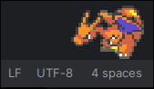

# Bongo Cat + V-Pets Wayland Overlay

[](https://opensource.org/licenses/MIT)
[](https://github.com/furudbat/wayland-vpets/releases)
[](https://github.com/furudbat/wayland-vpets/actions/workflows/release.yml)

A delightful Wayland overlay that displays an animated V-Pet reacting to your keyboard input! 
Perfect for streamers, content creators, or anyone who wants to add some fun to their desktop.

## 🖼️ Demo

  
_Classic Bongocat_

  
_Digimon V-Pets_

  
_Clippy_

  
_Pokemon_

## ✨ Features

- **🐈 More Pets** - More Sprite to choose from
  - Bongocat 😺
  - Digimon V-Pets 🦖 (v1.3.0)
  - Clippy 📎 (v2.1.0)
  - Pokemon 🐭 (v3.0.0)
  - Misc 🐈‍⬛ (v3.2.2)
- **🎯 Real-time Animation** - Bongo cat reacts instantly to keyboard input
- **🔥 Hot-Reload Configuration** - Modify settings without restarting (v1.2.0)
- **🔄 Dynamic Device Detection** - Automatically detects Bluetooth/USB keyboards (v1.2.0)
- **⚡ Performance Optimized** - Adaptive monitoring and batch processing (v1.4.0)
  - triggers rendering, only when needed (v2.0.0)
- **🖥️ Screen Detection** - Automatic screen detection for all sizes and orientations (v1.2.2)
- **🎮 Smart Fullscreen Detection** - Automatically hides during fullscreen applications (v1.2.3)
- **🖥️ Multi-Monitor Support** - Choose which monitor to display on in multi-monitor setups (v1.2.4)
- **😴 Sleep Mode** - Scheduled or idle-based sleep mode with custom timing (v1.2.5)
- **🎨 Customizable Appearance** - Fine-tune position, size, alignment, and opacity
- **💾 Lightweight** - Minimal resource usage (~10MB RAM, depends on the loaded sprites)
  - Lazy loading - Load only used assets into RAM (v2.4.0)
- **🎛️ Multi-device Support** - Monitor multiple keyboards simultaneously
- **🏗️ Cross-platform** - Works on x86_64 and ARM64
- **😄 Happy Frame** - Reach KPM (Keystroke per minute) to trigger the happy frame (Digimon)
- **🎲 Random Frame** - Randomize sprite frame at start up (Digimon) (v2.4.0)
- **🔲 CPU Stat** - React to CPU usage (Digimon) (v3.1.0)
- **↔️ Movement** - Movement on screen (Digimon) (v3.2.0)
- **🔢 Custom Sprite-Sheet** - Load your own Sprite Sheet at runtime (v3.3.0)

## 🏁 Getting Started

### 1. Install the App, Arch Linux (Recommended)

```bash
# Install using yay
yay -S wpets

# Or using paru
paru -S wpets
```

### 2. Configure Permissions

```bash
# Add user to input group for keyboard access
sudo usermod -a -G input $USER
# Log out and back in for changes to take effect
```

### 3. Find Your Input Devices

```bash
# Installed via AUR
wpets-find-devices
```

### 4. Configure Bongo Cat

Create or edit `~/.config/bongocat.conf`:

```ini
# Example minimal configuration
cat_x_offset=0
cat_y_offset=0
cat_align=center
cat_height=60
overlay_height=80
overlay_opacity=150
overlay_position=top
layer=overlay
fps=60
enable_antialiasing=1
animation_name=bongocat
keypress_duration=200

# add devices found with find-devices
keyboard_device=/dev/input/event4       # Keyboard
```

Full configuration reference: see the [Configuration Section](#%EF%B8%8F-configuration) below.

### 5. Run the Overlay

```bash
wpets --watch-config --config ~/.config/bongocat.conf
```


## 🚀 Installation

### Arch Linux (Recommended)

```bash
# Install using yay
yay -S wpets

# Using paru
paru -S wpets

# Run immediately
wpets --watch-config

# Custom config with hot-reload
wpets --config ~/.config/bongocat.conf --watch-config


# drop-in replacement for bongocat
wpets --config ~/.config/bongocat.conf --watch-config

# only pokemon sprites
wpets-pkmn --config ~/.config/pkmn.bongocat.conf --watch-config

# all sprites available (Recommended)
wpets-all --config ~/.config/bongocat.conf --watch-config
```

_`wpets` is the default **minimal** binary. **`wpets-all`** and `wpets-pkmn` are variants with specific sprite sets._  
_Just use `wpets-all` with all sprites included, try out all the pets._

#### From Source ⚠️

```bash
# Install dependencies
pacman -S gcc make cmake libinput wayland wayland-protocols

# Clone repository
git clone https://github.com/furudbat/wayland-vpets.git
cd wayland-vpets

# Build
cmake -S . -B build -DCMAKE_BUILD_TYPE=Release
cmake --build build

# Install - ⚠️ - If you only want to test without replacing bongocat, run the binary directly from `./build/` instead of installing.
sudo cmake --install build
```

**⚠️ this will overwrite the original installation of [bongocat](https://github.com/saatvik333/wayland-bongocat) ⚠️**


### Other Distributions

<details>
<summary>Fedora</summary>

```bash
# Install dependencies
sudo dnf install wayland-devel wayland-protocols-devel gcc make cmake

# Build from source
git clone https://github.com/furudbat/wayland-vpets.git
cd wayland-vpets
cmake -B build
cmake --build build

# Run
./build/bongocat
```

</details>

<details>
<summary>NixOS</summary>

```bash
# Quick start with flakes
nix run github:furudbat/wayland-vpets -- --watch-config

# Install to user profile
nix profile install github:furudbat/wayland-vpets
```

📖 **For comprehensive NixOS setup, see [nix/NIXOS.md](nix/NIXOS.md)**

</details>

## 🎮 Run

### 1. Setup Permissions (once)

```bash
# Add your user to the input group
sudo usermod -a -G input $USER
# Log out and back in for changes to take effect
```

### 3. Run with Hot-Reload

```bash
# AUR installation
wpets --watch-config

# From source
./build/bongocat --watch-config
```

## ⚙️ Configuration

Once installed, you can customize Bongo Cat Bar using a simple config file.

### Basic Configuration

Create or edit `bongocat.conf`:

```ini
# Position settings
cat_x_offset=0                   # Horizontal offset from center position
cat_y_offset=0                   # Vertical offset from default position
cat_align=center                 # Horizontal alignment in the bar (left/center/right)

# Size settings
cat_height=80                    # Height of bongo cat (10-200)

# Visual settings
mirror_x=0                       # Flip horizontally (mirror across Y axis)
mirror_y=0                       # Flip vertically (mirror across X axis)

# Anti-aliasing settings
enable_antialiasing=1            # Use bilinear interpolation for smooth scaling (0=off, 1=on)

# Overlay settings (requires restart)
overlay_height=60                # Height of the entire overlay bar (20-300)
overlay_opacity=150              # Background opacity (0-255)
overlay_position=top             # Position on screen (top/bottom)

# Animation settings
idle_frame=0                     # Frame to show when idle (0-3)
fps=60                           # Frame rate (1-120)
keypress_duration=100            # Animation duration (ms)

# Input devices (add multiple lines for multiple keyboards)
keyboard_device=/dev/input/event4
# keyboard_device=/dev/input/event20  # External/Bluetooth keyboard

# Multi-monitor support
monitor=eDP-1                    # Specify which monitor to display on (optional)

# Sleep mode settings
enable_scheduled_sleep=0         # Enable scheduled sleep mode (0=off, 1=on)
sleep_begin=20:00                # Begin of sleeping phase (HH:MM)
sleep_end=06:00                  # End of sleeping phase (HH:MM)
idle_sleep_timeout=0             # Inactivity timeout before sleep (seconds, 0=off)

# Debug
enable_debug=0                   # Show debug messages
```

### Configuration Reference

| Setting                   | Type     | Range / Options                                            | Default       | Description                                                                             |
|---------------------------|----------|------------------------------------------------------------|---------------|-----------------------------------------------------------------------------------------|
| `cat_height`              | Integer  | 10–200                                                     | 40            | Height of bongo cat in pixels (width auto-calculated to maintain aspect ratio)          |
| `cat_x_offset`            | Integer  | -16000 to 16000                                            | 100           | Horizontal offset from center (behavior depends on `cat_align`)                         |
| `cat_y_offset`            | Integer  | -16000 to 16000                                            | 10            | Vertical offset from center (positive=down, negative=up)                                |
| `cat_align`               | String   | "center", "left", "right"                                  | "center"      | Horizontal alignment of cat inside overlay bar                                          |
| `overlay_height`          | Integer  | 20–300                                                     | 50            | Height of the entire overlay bar                                                        |
| `overlay_position`        | String   | "top" or "bottom"                                          | "top"         | Position of overlay on screen                                                           |
| `overlay_opacity`         | Integer  | 0–255                                                      | 60            | Background opacity (0=transparent, 255=opaque)                                          |
| `overlay_layer`           | String   | "overlay", "top", "bottom" or "background"                 | "overlay"     | Surface layer of overlay on screen                                                      |
| `animation_name`          | String   | "bongocat", `<digimon name>`, "clippy" or `<pokemon name>` | "bongocat"    | Name of the V-Pet sprite (see list below)                                               |
| `invert_color`            | Boolean  | 0 or 1                                                     | 0             | Invert color (useful for white digimon sprites & dark mode)                             |
| `padding_x`               | Integer  | 0–9999                                                     | 0             | Horizontal padding per frame (ignored for bongocat)                                     |
| `padding_y`               | Integer  | 0–9999                                                     | 0             | Vertical padding per frame (ignored for bongocat)                                       |
| `idle_frame`              | Integer  | 0–2 (varies by sprite type)                                | 0             | Which frame to use when idle (sprite-specific options)                                  |
| `idle_animation`          | Boolean  | 0 or 1                                                     | 0             | Enable idle animation                                                                   |
| `animation_speed`         | Integer  | 0–5000                                                     | 0             | Frame duration in ms (0 = use `fps`)                                                    |
| `keypress_duration`       | Integer  | 50–5000                                                    | 100           | Duration to display keypress animation (ms)                                             |
| `mirror_x`                | Boolean  | 0 or 1                                                     | 0             | Flip cat horizontally (mirror across Y axis)                                            |
| `mirror_y`                | Boolean  | 0 or 1                                                     | 0             | Flip cat vertically (mirror across X axis)                                              |
| `test_animation_duration` | Integer  | 0–5000                                                     | 0             | Duration of test animation (ms) (deprecated, use `animation_speed`)                     |
| `test_animation_interval` | Integer  | 0–60                                                       | 0             | Interval for test animation in seconds (0 = disabled, deprecated)                       |
| `fps`                     | Integer  | 1–144                                                      | 60            | Animation frame rate                                                                    |
| `input_fps`               | Integer  | 0–144                                                      | 0             | Input thread frame rate (0 = use `fps`)                                                 |
| `enable_scheduled_sleep`  | Boolean  | 0 or 1                                                     | 0             | Enable scheduled sleep mode                                                             |
| `sleep_begin`             | String   | "00:00" – "23:59"                                          | "00:00"       | Start time of scheduled sleep (24h format)                                              |
| `sleep_end`               | String   | "00:00" – "23:59"                                          | "00:00"       | End time of scheduled sleep (24h format)                                                |
| `idle_sleep_timeout`      | Integer  | 0+                                                         | 0             | Time of inactivity before entering sleep (0 = disabled) (in seconds)                    |
| `happy_kpm`               | Integer  | 0–10000                                                    | 0             | Minimum keystrokes per minute to trigger happy animation (0 = disabled)                 |
| `keyboard_device`         | String   | Valid `/dev/input/*` path(s)                               | \<No Device\> | Input device path (multiple entries allowed)                                            |
| `enable_antialiasing`     | Boolean  | 0 or 1                                                     | 1             | Enable bilinear interpolation for smooth scaling (Bongocat and MS Agent only)           |
| `enable_debug`            | Boolean  | 0 or 1                                                     | 0             | Enable debug logging                                                                    |
| `monitor`                 | String   | Monitor name                                               | Auto-detect   | Which monitor to display on (e.g., "eDP-1", "HDMI-A-1")                                 |
| `random`                  | Boolean  | 0 or 1                                                     | 0             | Randomize `animation_index` (`animation_name` needs to be set as base sprite sheet set) |
| `update_rate`             | Integer  | 0–10000                                                    | 0             | Check (CPU) states rate (0 = disabled) (in milliseconds)                                |
| `cpu_threshold`           | Integer  | 0–100                                                      | 0             | Threshold of CPU usage for triggering work animation (0 = disabled)                     |
| `movement_radius`         | Integer  | 0-8000                                                     | 0             | Radius of moving area (0 = disabled)                                                    |
| `movement_speed`          | Integer  | 0–5000                                                     | 0             | Movement speed (0 = disabled)                                                           |
| `enable_movement_debug`   | Boolean  | 0 or 1                                                     | 0             | Show Movement area                                                                      |

#### Available Sprites (`animation_name`)

See man pages for more details and full list:

 - [Bongocat 😺](docs/fragments/set-bongocat.md)
 - [MS Agent 📎](docs/fragments/set-ms-agent.md) Clippy and friends
 - [Pokemon 🐭](docs/fragments/set-pkmn.md) up to Gen. 7
 - [Misc 🐈‍⬛](docs/fragments/set-misc.md)

##### Digimon 🦖

 - [Original](docs/fragments/set-dm.md) [`dm`](https://humulos.com/digimon/dm/)
 - [Pendulum Original](docs/fragments/set-pen.md) [`pen`](https://humulos.com/digimon/pen/)
 - [20th Anniversary](docs/fragments/set-dm20.md) [`dm20`](https://humulos.com/digimon/dm20/)
 - [Pendulum Ver.20th](docs/fragments/set-pen20.md) [`pen20`](https://humulos.com/digimon/pen20/)
 - [X](docs/fragments/set-dmx.md) [`dmx`](https://humulos.com/digimon/dmx/)
 - [Colored](docs/fragments/set-dmc.md) [`dmc`](https://humulos.com/digimon/dmc/)

_If you build with ALL assets included you can void naming conflicts by using the full name: `dm:Greymon`, `dm20:Greymon`, `dmc:Greymon`_


#### Custom Sprite Sheet (`custom_...`)

| **Key**                               | **Type** | **Range / Example** | **Default**       | **Description**                                                                      |
| ------------------------------------- | -------- |---------------------|-------------------|--------------------------------------------------------------------------------------|
| `animation_name`                      | String   | `"custom"`          |                   | Must be `"custom"` for custom-options to work                                        |
| `custom_sprite_sheet_filename`        | String   | Path to image file  |                   | Path to the custom sprite sheet image (**must be png**)                              |
| `custom_idle_frames`                  | Integer  | 1-500               | 0 (disabled)      | Number of frames for idle animation                                                  |
| `custom_boring_frames`                | Integer  | 1-500               | 0 (disabled)      | Number of frames for boring animation                                                |
| `custom_start_writing_frames`         | Integer  | 1-500               | 0 (disabled)      | Number of frames for start writing animation                                         |
| `custom_writing_frames`               | Integer  | 1-500               | 0 (disabled)      | Number of frames for writing animation                                               |
| `custom_end_writing_frames`           | Integer  | 1-500               | 0 (disabled)      | Number of frames for end writing animation                                           |
| `custom_happy_frames`                 | Integer  | 1-500               | 0 (disabled)      | Number of frames for happy animation                                                 |
| `custom_asleep_frames`                | Integer  | 1-500               | 0 (disabled)      | Number of frames for falling asleep animation                                        |
| `custom_sleep_frames`                 | Integer  | 1-500               | 0 (disabled)      | Number of frames for sleeping animation                                              |
| `custom_wake_up_frames`               | Integer  | 1-500               | 0 (disabled)      | Number of frames for waking up animation                                             |
| `custom_start_working_frames`         | Integer  | 1-500               | 0 (disabled)      | Number of frames for start working animation                                         |
| `custom_working_frames`               | Integer  | 1-500               | 0 (disabled)      | Number of frames for working animation                                               |
| `custom_end_working_frames`           | Integer  | 1-500               | 0 (disabled)      | Number of frames for end working animation                                           |
| `custom_start_moving_frames`          | Integer  | 1-500               | 0 (disabled)      | Number of frames for start moving animation                                          |
| `custom_moving_frames`                | Integer  | 1-500               | 0 (disabled)      | Number of frames for moving animation                                                |
| `custom_end_moving_frames`            | Integer  | 1-500               | 0 (disabled)      | Number of frames for end moving animation                                            |
| `custom_toggle_writing_frames`        | Boolean  | 0 or 1              | -1 (auto)         | Toggle writing frames when writing (`custom_writing_frames` needs to be `2`)         |
| `custom_toggle_writing_frames_random` | Boolean  | 0 or 1              | -1 (auto)         | Randomize writing frame when start writing (`custom_writing_frames` needs to be `2`) |
| `custom_mirror_x_moving`              | Boolean  | 0 or 1              | -1 (ignore)       | Mirror frames horizontally when moving                                               |
| `custom_idle_row`                     | Integer  | 1-15                | -1 (auto)         | Row nr for idle animation in sprite sheet                                            |
| `custom_boring_row`                   | Integer  | 1-15                | -1 (auto)         | Row nr for boring animation                                                          |
| `custom_start_writing_row`            | Integer  | 1-15                | -1 (auto)         | Row nr for start writing animation                                                   |
| `custom_writing_row`                  | Integer  | 1-15                | -1 (auto)         | Row nr for writing animation                                                         |
| `custom_end_writing_row`              | Integer  | 1-15                | -1 (auto)         | Row nr for end writing animation                                                     |
| `custom_happy_row`                    | Integer  | 1-15                | -1 (auto)         | Row nr for happy animation                                                           |
| `custom_asleep_row`                   | Integer  | 1-15                | -1 (auto)         | Row nr for asleep animation                                                          |
| `custom_sleep_row`                    | Integer  | 1-15                | -1 (auto)         | Row nr for sleep animation                                                           |
| `custom_wake_up_row`                  | Integer  | 1-15                | -1 (auto)         | Row nr for wake-up animation                                                         |
| `custom_start_working_row`            | Integer  | 1-15                | -1 (auto)         | Row nr for start working animation                                                   |
| `custom_working_row`                  | Integer  | 1-15                | -1 (auto)         | Row nr for working animation                                                         |
| `custom_end_working_row`              | Integer  | 1-15                | -1 (auto)         | Row nr for end working animation                                                     |
| `custom_start_moving_row`             | Integer  | 1-15                | -1 (auto)         | Row nr for start moving animation                                                    |
| `custom_moving_row`                   | Integer  | 1-15                | -1 (auto)         | Row nr for moving animation                                                          |
| `custom_end_moving_row`               | Integer  | 1-15                | -1 (auto)         | Row nr for end moving animation                                                      |


See [examples](examples/custom-sprite-sheets) for more details.

## 🔧 Usage

### Command Line Options

```bash
wpets [OPTIONS]

Options:
  -h, --help                Show this help message
  -v, --version             Show version information
  -c, --config              Specify config file (default: ~/.config/bongocat.conf)
  -w, --watch-config        Watch config file for changes and reload automatically
  -t, --toggle              Toggle bongocat on/off (start if not running, stop if running)
  -o, --output-name NAME    Specify output name (overwrite output_name from config)
      --random              Randomize animation_name at start up
      --strict              Only start up with a valid config and valid parameter
      --nr NR               Specify Nr. for PID file to avoid conflicting ruinning instances
      --ignore-running      Ignore current running instance (avoid PID file conflicts)
```

### Examples

```bash
# Basic usage
wpets

# With hot-reload (recommended)
wpets --watch-config

# Custom config with hot-reload
wpets --config ~/.config/bongocat.conf --watch-config

# Debug mode
wpets --watch-config --config bongocat.conf

# Toggle mode
wpets --toggle

# Custom config with hot-reload and custom output_name
wpets --watch-config --output-name DP-2 --config ~/.config/bongocat.conf
```

See [`examples/`](examples) for more configs.

#### Hyprland

For [`hyprland`](https://hypr.land/) users, you can autostart `wpets` in your `hyprland.conf`:

```ini
# Auto start
exec-once = wpets-all --watch-config --config ~/.config/bongocat/screen1.bongocat.conf -o HDMI-A-1
exec-once = wpets-all --watch-config --config ~/.config/bongocat/screen2.bongocat.conf -o DP-1
exec-once = wpets-all --watch-config --config ~/.config/bongocat/screen3.bongocat.conf
exec-once = wpets-all --watch-config --config ~/.config/bongocat/screen4.bongocat.conf --random
```

## 🛠️ Building from Source

### Prerequisites

Before building, ensure your system has the required tools and libraries:

#### Required:

- Wayland compositor with layer shell support
- C23/C++23 compiler (GCC 15+ or Clang 19+)
- CMake and make
- `libwayland-client`
- `wayland-protocols`
- `wayland-scanner`
- `libudev`

##### Arch Linux / Manjaro:

```bash
sudo pacman -S git gcc g++ clang cmake base-devel libinput wayland wayland-protocols systemd-libs`
```

##### Fedora: 

```bash
sudo dnf install -y @c-development git-core cmake glibc-langpack-en 'pkgconfig(libevdev)' 'pkgconfig(libinput)' 'pkgconfig(libudev)' 'pkgconfig(wayland-client)' 'pkgconfig(wayland-protocols)'
```

##### Debian / Ubuntu:

```bash
sudo apt-get install build-essential cmake libinput-dev libudev-dev libwayland-dev wayland-protocols
```

### Build Instructions

```bash
# Clone repository
git clone https://github.com/furudbat/wayland-vpets.git
cd wayland-vpets

# Build (Release or Debug)
cmake -S . -B build -DCMAKE_BUILD_TYPE=Release   # Or Debug
cmake --build build

# Clean
cmake --build build --target clean
```

The build process automatically:

1. Generates Wayland protocol files
2. Compiles with optimizations and security hardening
3. Embeds assets directly in the binary
4. Links with required libraries


## 🔍 Device Discovery

The `wpets-find-devices` tool provides professional input device analysis with a clean, user-friendly interface:

```bash
$ wpets-find-devices

╔══════════════════════════════════════════════════════════════════╗
║ Wayland Bongo Cat - Input Device Discovery v3.1.0                ║
╚══════════════════════════════════════════════════════════════════╝

[SCAN] Scanning for input devices...

[DEVICES] Found Input Devices:
┌─────────────────────────────────────────────────────────────────┐
│ Device: AT Translated Set 2 keyboard                            │
│ Path:   /dev/input/event4                                       │
│ Type:   Keyboard                                                │
│ Status: [OK] Accessible                                         │
└─────────────────────────────────────────────────────────────────┘

┌─────────────────────────────────────────────────────────────────┐
│ Device: Logitech MX Keys                                        │
│ Path:   /dev/input/event20                                      │
│ Type:   Keyboard (Bluetooth)                                    │
│ Status: [OK] Accessible                                         │
└─────────────────────────────────────────────────────────────────┘

[CONFIG] Configuration Suggestions:
Add these lines to your bongocat.conf:

keyboard_device=/dev/input/event4   # AT Translated Set 2 keyboard
keyboard_device=/dev/input/event20  # Logitech MX Keys
```

### Advanced Features

```bash
# Show all input devices (including mice, touchpads)
wpets-find-devices --all

# Generate complete configuration file
wpets-find-devices --generate-config > bongocat.conf

# Generate complete configuration file with named devices by-id
wpets-find-devices --generate-config --by-id > bongocat.conf

# Test device responsiveness (requires root)
sudo wpets-find-devices --test

# Show detailed device information
wpets-find-devices --verbose

# Get help and usage information
wpets-find-devices --help
```

### Key Features

- **Smart Detection** - Automatically identifies keyboards vs other input devices
- **Device Classification** - Distinguishes between built-in, Bluetooth, and USB keyboards
- **Permission Checking** - Verifies device accessibility and provides fix suggestions
- **Config Generation** - Creates ready-to-use configuration snippets
- **Device Testing** - Integrated evtest functionality for troubleshooting
- **Professional UI** - Clean, colorized output with status indicators
- **Error Handling** - Comprehensive error messages and troubleshooting guidance

## 📊 Performance

### System Requirements

This program is lightweight and runs even on very modern desktop systems.  
Minimal builds require only a few MB of RAM, whereas asset-heavy builds use more.

## 🖥️ System Requirements

|                | Minimum                                                  | Recommended                                                                  |
|----------------|----------------------------------------------------------|------------------------------------------------------------------------------|
| **CPU**        | Any modern **x86_64** or **ARM64** processor (SSE2/NEON) | Dual-core **x86_64** or **ARM64** processor                                  |
| **RAM**        | **8 MB free** (minimal build with minimal assets)        | **64 MB free** (full builds with all assets, preloaded, and config overhead) |
| **Storage**    | **6 MB free** (binary + config files)                    | **20 MB free** (multiple binaries/builds + config files)                     |
| **Compositor** | Wayland with **wlr-layer-shell** protocol support        | Modern Wayland compositor (Sway, Hyprland, Wayfire, KDE Plasma 6)            |


### Tested Compositors

- ✅ **Hyprland** - Full support
- ✅ **Sway** - Full support
- ✅ **Wayfire** - Compatible
- ✅ **KDE Wayland** - Compatible
- ❌ **GNOME Wayland** - Unsupported

## 🐛 Troubleshooting

Enable debug logging for detailed output:
```bash
# ensure enable_debug=1 in bongocat.conf
wpets --watch-config --config bongocat.conf
```

### Common Issues

<details>
<summary>Permission denied accessing `/dev/input/eventX`</summary>

**Solution:**

```bash
# Add user to input group (recommended)
sudo usermod -a -G input $USER
# Log out and back in

# Or create udev rule
echo 'KERNEL=="event*", GROUP="input", MODE="0664"' | sudo tee /etc/udev/rules.d/99-input.rules
sudo udevadm control --reload-rules
```

</details>

<details>
<summary>Keyboard input not detected</summary>

**Diagnosis:**

```bash
# Find correct device
wpets-find-devices

# Test device manually
sudo evtest /dev/input/event4
```

**Solution:** Update `keyboard_device` in `bongocat.conf` with correct path.

</details>

<details>
<summary>Overlay not visible or clickable</summary>

**Check:**

- Ensure compositor supports `wlr-layer-shell-unstable-v1`
- Verify `WAYLAND_DISPLAY` environment variable is set
- Try different `overlay_opacity` values

**Tested compositors:** Hyprland, Sway, Wayfire

</details>

<details>
<summary>Multi-monitor setup issues</summary>

**Finding monitor names:**

```bash
# Using wlr-randr (recommended)
wlr-randr

# Using swaymsg (Sway only)
swaymsg -t get_outputs

# Check bongocat logs for detected monitors
wpets --watch-config  # Look for "xdg-output name received" messages
```

**Configuration:**

```ini
# Specify exact monitor name
monitor=eDP-1        # Laptop screen
monitor=HDMI-A-1     # External HDMI monitor
monitor=DP-1         # DisplayPort monitor
```

**Troubleshooting:**

- If monitor name is wrong, bongocat falls back to first available monitor
- Monitor names are case-sensitive
- Remove or comment out `monitor=` line to use auto-detection
</details>

<details>
<summary>Build errors</summary>

**Common fixes:**

- Install development packages: `libwayland-dev wayland-protocols`
- Ensure C23/C++23 compiler: GCC 15+ or Clang 19+ _(requires [`#embed`](https://en.cppreference.com/w/c/preprocessor/embed.html) feature)_
- Install `wayland-scanner` package
</details>

### Getting Help

1. Enable debug logging: `wpets --watch-config` (ensure `enable_debug=1`)
2. Check compositor compatibility
3. Verify all dependencies are installed
4. Test with minimal configuration

## 🏗️ Architecture

### Project Structure

- `assets/` - Sprite sheets and media
- `src/` - Core application logic and platform-specific code
- `include/` - Headers
- `scripts/` - Utilities and codegen
- `lib/` - External libraries

```
wayland-vpets/
├── assets/             # sprite sheets and media resources
├── Dockerfiles/        # Container build definitions
├── examples/           # Example configurations
├── include/            # Header files (same structure as src/)
├── lib/                # External libraries (image loader)
├── nix/                # NixOS integration
├── protocols/          # Generated Wayland protocols
├── scripts/            # Codegen and utility scripts
└── src/                # Source code
├──── config/           # Configuration system implementation
├──── core/             # Core application logic (main)
├──── embedded_assets/  # Embedded assets
├──── graphics/         # Rendering and graphics implementation
├──── image_loader/     # Assets loading implementations
├──── platform/         # Platform-specific code (input and wayland)
└──── utils/            # General utilities
```

## 🤝 Contributing

This project follows industry best practices with a modular architecture.  
Issues and pull requests are welcome! See [CONTRIBUTING.md](CONTRIBUTING.md) for details.


### Development Setup

#### Build with CMake (Recommended)

```bash
cmake -S . -B build -DCMAKE_BUILD_TYPE=Debug
cmake --build build
```

#### Legacy `make` (for old `bongocat` users)

```bash
git clone https://github.com/furudbat/wayland-vpets.git
cd wayland-vpets
make debug
```

`make debug` provides a quick debug build.
You can inspect the old workflow in the old [`Makefile`](Makefile.old).  
_**Note:** The binary name in AUR is `wpets`, but during development and `make install` it is still `bongocat`._

### Code Standards

- C23/C++23 standard compliance
- Comprehensive error handling
- Memory safety with leak detection
- Extensive documentation

#### Moving to C++

The project is gradually migrating to C++ while retaining a C-style foundation for performance and Wayland compatibility.

For more details, see the [Code Standards section in CONTRIBUTING](CONTRIBUTING.md#code-standards).  

The project remains largely C under the hood, using Linux + Wayland libraries, while gradually adopting modern C++ practices for safety and maintainability.

## 📄 License

MIT License - see [LICENSE](LICENSE) file for details.

## 🙏 Acknowledgments

Built with ❤️ for the Wayland community. Special thanks to:

- Redditor: [u/akonzu](https://www.reddit.com/user/akonzu/) for the inspiration
- [@Shreyabardia](https://github.com/Shreyabardia) for the beautiful custom-drawn bongo cat artwork
- All the contributors and users
- [Waybar](https://github.com/Alexays/Waybar)


<details>
<summary>Copyright</summary>

This project is **free**, **non-commercial** and not associated with these entities.
Pokémon are owned by Nintendo, Creatures Inc. and GAME FREAK Inc.
Digimon and all related characters, and associated images are owned by Bandai Co., Ltd, Akiyoshi Hongo, and Toei Animation Co., Ltd.
Clippy and other MS Agents are owed by Microsoft.
See [COPYRIGHT](assets/COPYRIGHT.md) for more details.
</details>

---

**₍^. .^₎ Wayland Bongo Cat Overlay v3.3.1** - Making desktops more delightful, one keystroke at a time!
Now with Digimon V-Pets, Clippy and Pokémon.
