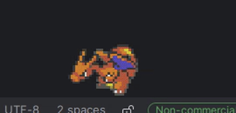

# Copyright

## Bongocat

custom-drawn bongo cat artwork by [@Shreyabardia](https://github.com/Shreyabardia)

## 3rd Party

This project is **free**, **non-commercial** and is not associated with the entities below.

### Digimon

Digimon and all related characters, and associated images are owned by Bandai Co., Ltd, Akiyoshi Hongo, and Toei Animation Co., Ltd.

### Pokemon

Pokemon sprite- and images are owned by Nintendo, Creatures Inc. and GAME FREAK Inc.

### MS Agent (Clippy)

Clippy and other MS Agents are owed by Microsoft.
This project is **free**, **non-commercial** and not associated with these entities.

## Special Thanks

- [humulos](https://www.youtube.com/channel/UCVx-uPYR8xyax_tHJjFddhw) and [Digitama Hatchery](https://humulos.com/digimon/) 
- [Wikimon](https://wikimon.net/) 
- [Airshuffler](https://www.spriters-resource.com/submitter/airshuffler/) - digimon v-pet sprites
- [Tortoiseshel](https://withthewill.net/threads/full-color-digimon-dot-sprites.25843/) - colored digimon sprites
- [Siul](https://www.spriters-resource.com/pc_computer/microsoftofficexp/sheet/104487/) - MS agent sprites
- https://github.com/msikma/pokesprite
- [bulbagarden Wiki](https://archives.bulbagarden.net/wiki/Category:Animated_menu_sprites)
