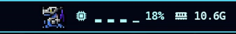
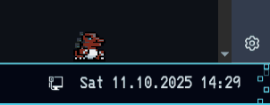

# Examples

## animated digimon (no Input)


```ini
cat_x_offset=300
cat_y_offset=0
cat_align=left
cat_height=48

overlay_height=50
overlay_position=top
overlay_opacity=0

# Sprite settings
animation_name=Agumon
invert_color=0

# idle_animation: Enable idle animation (0 = off, 1 = on)
idle_animation=1
animation_speed=1000

fps=5
input_fps=60
enable_debug=0

# No Devices
```

## CPU usage animation



```ini
cat_x_offset=740
cat_y_offset=0
cat_align=right
cat_height=48

overlay_height=50
overlay_position=top
overlay_opacity=0

# Sprite settings
animation_name=dm20:tyranomon
invert_color=1

# NOTE: OVERLAY SETTINGS DOESN'T WORK WITH HOT RELOAD, NEEDS BONGOCAT RESTART
# Work Animation
# update_rate: Check states rate (in milliseconds) (0 = disabled)
update_rate=10000
# cpu_threshold: Threshold of avg. CPU usage for triggering work animation (0 = disabled)
cpu_threshold=90

fps=15

# No Devices
```


## Digimon


```ini
cat_x_offset=300
cat_y_offset=0
cat_align=left
cat_height=48

overlay_height=50
overlay_position=top
overlay_opacity=0

# Sprite settings
animation_name=dm20:greymon
invert_color=1

# Sleep Mode settings
enable_scheduled_sleep=1
sleep_begin=21:00
sleep_end=06:00
idle_sleep_timeout=3600

# Happy Animation
happy_kpm=400

# Animation timing (in milliseconds)
keypress_duration=500
fps=15
input_fps=60

# Input devices (you can specify multiple devices)
# Use keyboard_device for each device you want to monitor
# Examples:
# keyboard_device=/dev/input/event4
# keyboard_device=/dev/input/event20  # External bluetooth keyboard (commented out - doesn't exist)
# keyboard_device=/dev/input/event5   # Another input device

#TODO: Your Input devices here
```


## Digimon (colored)


```ini
cat_x_offset=300
cat_y_offset=-5
cat_align=left
cat_height=55

overlay_height=60
overlay_position=top
overlay_opacity=0

# NOTE: ANIMATION FROM DIFFERENT TYPE DOESN'T WORK WITH HOT RELOAD, NEEDS BONGOCAT RESTART OR BUILD WITH LAZY LOAD (e.g. "bongocat" -> "clippy")
# animation_name: Animation index
# Default Options: "bongocat"
# dm Options: "Agumon", "Greymon", "metal_greymon", ...
# MS Agent Options: "Clippy"
# pkmn Options: "Bulbasaur", "Pikachu", ...
animation_name=dmc:Metal Greymon
invert_color=0

# Sleep Mode settings
enable_scheduled_sleep=0
sleep_begin=21:00
sleep_end=06:00
idle_sleep_timeout=1080

# Happy Animation
happy_kpm=400

# Animation timing (in milliseconds)
keypress_duration=500
fps=15
input_fps=60

# Input devices (you can specify multiple devices)
# Use keyboard_device for each device you want to monitor
# Examples:
# keyboard_device=/dev/input/event4
# keyboard_device=/dev/input/event20  # External bluetooth keyboard (commented out - doesn't exist)
# keyboard_device=/dev/input/event5   # Another input device

#TODO: Your Input devices here
```


## Clippy


```ini
cat_x_offset=0
cat_y_offset=0
cat_align=right
cat_height=96

overlay_height=100
overlay_position=bottom
overlay_opacity=0

animation_name=clippy
invert_color=0

# Sleep Mode settings
enable_scheduled_sleep=0
sleep_begin=21:00
sleep_end=06:00
idle_sleep_timeout=3600

# Animation timing (in milliseconds)
keypress_duration=300
animation_speed=120

fps=15
input_fps=60

# Input devices (you can specify multiple devices)
# Use keyboard_device for each device you want to monitor
# Examples:
# keyboard_device=/dev/input/event4
# keyboard_device=/dev/input/event20  # External bluetooth keyboard (commented out - doesn't exist)
# keyboard_device=/dev/input/event5   # Another input device

#TODO: Your Input devices here
```


## Moving Digimon



```ini
cat_x_offset=45
cat_y_offset=-18
cat_align=right
cat_height=45

overlay_height=100
overlay_position=bottom
overlay_opacity=0

animation_name=dmc:Tyranomon
invert_color=0

# Sleep Mode settings
enable_scheduled_sleep=0
sleep_begin=21:00
sleep_end=06:00
idle_sleep_timeout=3600

# Animation timing (in milliseconds)
keypress_duration=300
animation_speed=1000

# Movement Settings (experimental)
movement_radius=90
movement_speed=15
enable_movement_debug=0

fps=15
input_fps=60

# Input devices (you can specify multiple devices)
# Use keyboard_device for each device you want to monitor
# Examples:
# keyboard_device=/dev/input/event4
# keyboard_device=/dev/input/event20  # External bluetooth keyboard (commented out - doesn't exist)
# keyboard_device=/dev/input/event5   # Another input device

#TODO: Your Input devices here
```
