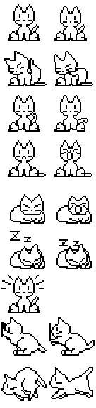
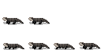
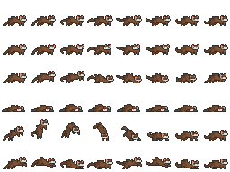

# Custom Sprite Sheets

Custom sprite sheets has a full animation per row.
To determine the number of rows, the number of frames needs to be provided per row.

- `Idle` -- Idle Pose
- `Boring` -- Boring animation for inactivity
- `StartWriting` -- First keystroke
- `Writing` -- Keep Typing (looping)
- `EndWriting` -- After last keystroke (return to Idle pose)
- `Happy` -- Show Happy animation when KPM is reached, while writing
- `FallAsleep` -- Start falling asleep
- `Sleep` -- Sleep (looping)
- `WakeUp` -- After sleep (back to Idle pose)
- `StartWorking` -- Start seen spike in CPU usage
- `Working` -- CPU usage over threshold (looping)
- `EndWorking` -- CPU usage under threshold (cooldown)
- `StartMoving` -- Start Moving
- `Moving` -- Moving (looping)
- `EndMoving` -- Stop moving

Rows can be skipped by not providing the frames/columns, but the order of the rows needs to be the same.


## General Example

**Sprite Sheet**

| Idle 1     | Idle 2     |          |          |
|------------|------------|----------|----------|
| Boring 1   | Boring 2   | Boring 3 | Boring 4 |
| Writing 1  | Writing 2  |          |          |
| Sleeping 1 | Sleeping 2 |          |          |
| Wake Up 1  |            |          |          |
| Moving 1   | Moving 2   |          |          |

**Sprite Sheet Settings**
- Idle = 1 frames
- Boring = 4 frames
- Writing = 2 frames
- Sleeping = 2 frames
- Wake Up = 1 frame
- Moving = 2 frame

`Idle`, `Writing`, `Sleeping` and `Moving` animations are set.
No `StartWriting` and `EndWriting` animation are provided when start typing, directly play the `Writing` animation.
`Sleeping` and `Wake Up` animation are provided so "Sleeping Mode" feature can be used.
If rows and animations are missing, some features can't be used, for example Working feature is disabled.
`Boring` animation are played after inactivity and before going to sleep.
`Moving` feature available and can can be enabled with moving options (see config `movement` options).


## Neko



- Idle animation (2 frames)
- Boring animation (2 frames)
- Writing animation (2 frames)
- Happy animation (2 frames)
- Start Sleeping animation (2 frames)
- Sleeping animation (2 frames)
- Wake up animation (1 frame)
- Working animation (2 frames)
- Moving animation (2 frames)

```ini
# Sprite Sheet Settings
animation_name=custom
custom_sprite_sheet_filename=neko.png
custom_idle_frames=2
custom_boring_frames=2
custom_writing_frames=2
custom_happy_frames=2
custom_asleep_frames=2
custom_sleep_frames=2
custom_wake_up_frames=1
custom_working_frames=2
custom_moving_frames=2
```

## skink

[skink](https://thestarvingartificer.itch.io/blue-tongued-skink) by TheStarvingArtificer

_minimal moving example, frames can vary_



- Idle animation (2 frames)
- Moving animation (4 frames)

```ini
# Sprite Sheet Settings
animation_name=custom
custom_sprite_sheet_filename=skink.png
custom_idle_frames=2
custom_moving_frames=4
```

## Blue witch

[Blue Witch](https://9e0.itch.io/witches-pack) by 9e0

_no writing animation, but with movement and more_


- Idle animation (6 frames)
- Fall asleep animation (12 frames)
- Sleep animation (1 frames)
- Wake up animation (12 frames)
- Working animation (5 frames)
- Moving animation (8 frames)

```ini
# Sprite Sheet Settings
animation_name=custom
custom_sprite_sheet_filename=witch.png
custom_idle_frames=6
custom_asleep_frames=12
custom_sleep_frames=1
custom_wake_up_frames=12
custom_working_frames=5
custom_moving_frames=8
custom_mirror_x_moving=1
```

_flip moving frames so the move direction is correct_

## ferret

[ferret](https://elthen.itch.io/2d-pixel-art-ferret-sprites) by Elthen



- Idle animation (8 frames)
- Boring animation (8 frames)
- Writing animation (8 frames)
- Sleep animation (8 frames)
- Working animation (8 frames)
- Moving animation (8 frames)

```ini
# Sprite Sheet Settings
animation_name=custom
custom_sprite_sheet_filename=ferret.png
custom_idle_frames=8
custom_boring_frames=8
custom_writing_frames=8
custom_sleep_frames=8
custom_working_frames=8
custom_moving_frames=8
custom_mirror_x_moving=1
```


## Know issues

### extra sprite when sprite is flipping (moving)

Please add some left and right empty padding in your frames.
Doing to some rounding error, when flipping the frame, some pixels can be visible from the nearer frames.